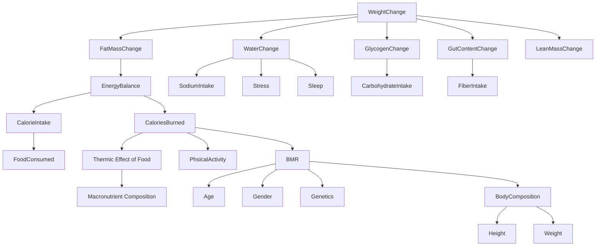

## Knowledge Graph Study: “Calorie surplus causes weight gain”

### Summary
- **Version 1**:
  - “calorie surplus causes weight gain”
  - Too simple
  - Ignores a lot of context 
  - Cannot catch some important dependencies
  - Multiple reasons pointing to one cause

- **Version 2**:
  - Introduced **WeightChange** as an event
  - Introduced **EnergyBalance / DeltaCalorie**
  - Want to avoid “everything points to weight gain”.

- **Version 3**:
  - Decomposed **WeightChange**
  - Introduced **fat, water, glycogen, gut content, lean mass**
  - Better matches real world observations

- **Main takeaways**: 
  - the “best” knowledge graph depends on **why** we are building it
  - there is a tradeoff between simplicity vs realism
  - simpler graphs are easier to use, but they might not consider important dependencies
  - more complex graphs are more accurate, but their utility and usefulness reduces
  - it is not possible (and not feasible) to have a flawless, perfect model which considers every detail
  - it is not helpful to have an extremely simple model which can be easy to use but inaccurate 

### Why we did this study
We are practicing **data modeling / knowledge graph thinking** by taking a familiar claim like **“having a calorie surplus causes weight gain”** and trying to represent it as a knowledge graph (RDF-style triples and dependency graphs).

- While working on this example we have seen that **real-world systems are conditional, contextual, and multi-factor**. 
- If we model them as unconditional “A causes B”, we quickly run into counterexamples.

---

### The original naive model (Version 1)
Our first attempt was the simplest possible RDF-like statement:

```
# v1 (too strong / too absolute)
:CalorieSurplus :causes :WeightGain .
```

**What felt wrong:**

This model implies the relationship is **always true** and **direct**. But in reality:
- **Energy expenditure** (calories burned) can change (more physical activity etc.).
- **Physiology/health** can change (medical conditions, medication, etc.).
- **Scale weight is not the same as fat mass**:
  - you can gain fat because of a calorie surplus
  - but it is possible to see a lower weight on the scale while having a calorie surplus
  - because water/glycogen/gut content also affect weight change
  - therefore, in addition to calorie balance, weight change depends on other things as well
- The statement also ignores:
  - **time** (“surplus over what window?”), 
  - **magnitude** (“how much surplus?”),
  - **measurement** (“scale weight vs body composition?”).

So the naive triple is:
- not “wrong” as a general intuition, 
- but it’s **overconfident** and **underspecified** to be a useful knowledge graph.

---

### Revision attempt (Version 2): introduce an important “event” and intermediate variables
We noticed that modeling many different “causes of WeightGain” created a weird-looking graph:
- **many arrows into a single node** (WeightGain), 
- this felt like our central concept was too absolute/strong.

So I reframed the target outcome into a more general event:
- **WeightChange** (not just gain, could be gain or loss)

And I introduced a key intermediate variable:
- **DeltaCalorie** (net calories, like [intake minus burned] )

Version 2 model:
- **WeightChange** depends on **DeltaCalorie**
- **DeltaCalorie** depends on **CalorieIntake** and **CaloriesBurned**
- **CalorieIntake** depends on **Food**
- **CaloriesBurned** depends on **Age**, **Gender**, **Genetics**, **PhysicalActivity**

**What are the adventages:**
- It separates the **mechanism** (energy balance) from the **outcome** (weight change).
- It creates a more clear structure: “WeightChange” is not directly caused by 20 different things;
  - Instead, many factors have effects via a smaller set of intermediates.

**What was still missing:**
- Even “net calories -> weight change” is still too absolute and naive, 
- Because **weight change is a sum of multiple compartments**, not just fat.

---

### Upgrade (Version 3): decompose WeightChange into components (fat, water, glycogen, etc.)
Based on further research, I revised the model to treat **scale weight change** as the result of multiple sub-changes:
- **FatMassChange**
- **WaterChange**
- **GlycogenChange**
- **GutContentChange**
- **LeanMassChange**


In this version, **EnergyBalance** primarily explains **FatMassChange**.

But total scale weight can change due to other components even when fat is changing in a different direction.

Version 3 dependency graph:



**Why Version 3 is a big improvement**
- **More accurate outcome definition**: 
  - “WeightChange” is not treated as “fat change only”.
- **Explains common real-life confusion**: 
  - one can be in a calorie deficit while the scale shows higher weight because of other factors like water/glycogen etc.
- **Cleaner dependency structure**: 
  - fat is linked to energy balance; water/glycogen/gut content have distinct drivers.

---

### The remaining shortcomings

- Even if each arrow looks reasonable, biology is not a simple DAG of independent arrows. 
- Many variables have **multiple roles**:
  - **Sleep** can affect **WaterChange**,
  - but also influences **FoodConsumed** (appetite/behavior),
  - and **PhysicalActivity** (energy, recovery).

So if we keep expanding, we quickly get a dense web of interdependencies and feedback loops.

**No model is flawless. Simplicity is what makes a model usable.**

The goal is not to capture all biology, but to capture a **useful abstraction** for a specific purpose.

---

### Model depends on “why”
Further refinement of v3 can depend on the use case (the “why”), for example, if we are working on:

- **Calorie tracker app**
  - Focus on: **EnergyBalance -> FatMassChange** and a lightweight “water/glycogen noise” explanation.
  - Likely trim: deep physiology, detailed sleep/stress pathways, some body composition detail.

- **Diet program / coaching**
  - Focus on: behaviors and levers people can change: **FoodConsumed**, **PhysicalActivity**, **FiberIntake**, **SodiumIntake**, **Sleep**.
  - Keep: water/glycogen/gut content because it helps set expectations and reduce frustration.

- **Athlete performance / body composition optimization**
  - Focus on: **training load**, **recovery (sleep)**, **macronutrient composition (TEF, carbs)**, and **lean mass** dynamics.
  - Keep: more explicit links from sleep/stress to both intake and burn (recovery affects training output).

---

### Expressing the “cause” relationship more safely in RDF
One reason v1 felt “false” is the verb **"causes"** is too absolute. 

It is healthier to model:
- **influences / contributesTo**
- or introduce context: “over a time window”, “in a person”, “given certain conditions”

Simple Example:

```
# Entities
:EnergyBalance :influences :FatMassChange .
:FatMassChange :contributesTo :WeightChange .

:CalorieIntake :partOf :EnergyBalance .
:CaloriesBurned :partOf :EnergyBalance .

# Non-fat components that contribute to scale weight change
:WaterChange :contributesTo :WeightChange .
:GlycogenChange :contributesTo :WeightChange .
:GutContentChange :contributesTo :WeightChange .
```

---

### Key lessons
1. **Avoid absolute causal claims**: 
    - “Surplus causes weight gain” hides conditions, time, and measurement type.
2. **Introduce intermediate variables**: 
    - adding **EnergyBalance** (or DeltaCalorie) improves structure and explanatory power.
3. **Define the outcome carefully**: 
    - “WeightChange” is a composite of fat, water, glycogen, gut content, and lean mass.
4. **Interdependencies are real, but optional**: 
    - you can model sleep/stress as direct and indirect influences, but you do not always need to.
5. **The right graph is purpose-driven**: 
    - choose what to include based on the decisions the KG should support.

---

### Possible “Version 4” improvements:
The next improvements I would consider are:
- **Add time windows**: weight change “per day” vs “per week” matters a lot.
- **Add a Person + Measurement layer**: separate “true tissue changes” from “observed scale weight”.
- **Add uncertainty/strength**: represent some edges as “often influences” rather than deterministic.
- **Add feedback loops where it matters**: for example, sleep <-> appetite <-> activity, but only if the use case needs it.


